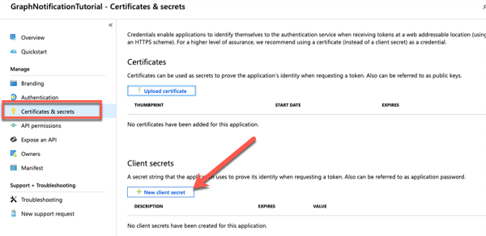

<!-- markdownlint-disable MD002 MD041 -->

Dans cet exercice, vous allez créer une nouvelle application Web Azure AD à l’aide du centre d’administration Azure Active Directory et accorder le consentement de l’administrateur aux étendues d’autorisation requises.

1. Ouvrez un navigateur et accédez au [Centre d’administration Azure Active Directory (https://aad.portal.azure.com)](https://aad.portal.azure.com). Connexion à l’aide d’un **compte professionnel ou scolaire**.

1. Sélectionnez **Azure Active Directory** dans le volet de navigation de gauche, puis sélectionnez **inscriptions des applications** sous **gérer**.

    

1. Sélectionnez **Nouvelle inscription**. Sur la page **inscrire une application**

    

    Définissez les valeurs comme suit:

    - **Nom**: GraphNotificationTutorial
    - **Types de comptes pris en charge**: comptes dans un annuaire d’organisation et des comptes Microsoft personnels
    - **URI**de redirection: > Webhttp://localhost

    

    Sélectionnez **Enregistrer**.

1. Sur la page **GraphNotificationTutorial** , copiez la valeur de l’ID d' **application (client)** et de l' **ID de répertoire (client)** enregistrez-la, vous en aurez besoin à l’étape suivante.

    

1. Sélectionnez **gérer les certificats de > & les secrets**. 

    Sélectionnez **nouvelle clé secrète client**.

    Entrez une valeur dans **Description** et sélectionnez l’une des options pour **** expirer, puis sélectionnez **Ajouter**.

    

    

1. Copiez la valeur du secret client avant de quitter cette page. Vous en aurez besoin à l’étape suivante.

    > [!IMPORTANT]
    > Ce secret client n’apparaîtra plus jamais, aussi veillez à le copier maintenant.

    

1. Sélectionnez **gérer les autorisations d’API de >**.

    Sélectionnez **Ajouter une autorisation** et sélectionnez **Microsoft Graph**.

    

    Sélectionnez **autorisation d’application**, développez le groupe d' **utilisateurs** et sélectionnez **utilisateur. ReadWrite. All** .

    Sélectionnez **Ajouter des autorisations** pour enregistrer vos modifications.

    

    

L’application demande une autorisation d’application avec l’étendue **User. ReadWrite. All** . Cette autorisation nécessite un consentement administratif.

Sélectionnez **accorder le consentement de l’administrateur pour Contoso**, puis sélectionnez **Oui** pour autoriser cette application et accorder à l’application l’accès à votre client en utilisant les étendues que vous avez spécifiées.

