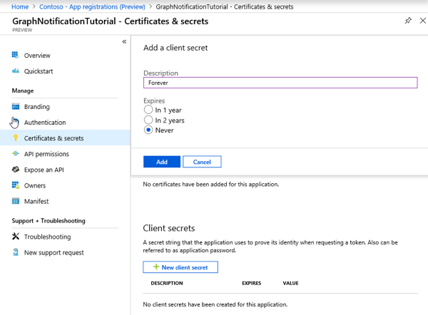

<!-- markdownlint-disable MD002 MD041 -->

Dans cet exercice, vous allez créer une nouvelle application Web Azure AD à l’aide du centre d’administration Azure Active Directory et accorder le consentement de l’administrateur aux étendues d’autorisation requises.In this exercise, you will create a new Azure AD web application registration using the Azure Active Directory admin center and grant administrator consent to the required permission scopes.

1. Ouvrez un navigateur et accédez au [Centre d’administration Azure Active Directory (https://aad.portal.azure.com)](https://aad.portal.azure.com).Open a browser and navigate to the [Azure Active Directory admin center (https://aad.portal.azure.com)](https://aad.portal.azure.com). Connexion à l’aide d’un **compte professionnel ou scolaire**.Login using a **Work or School Account**.

1. Sélectionnez **Azure Active Directory** dans le volet de navigation de gauche, puis sélectionnez **inscriptions des applications** sous **gérer**.Select **Azure Active Directory** in the left-hand navigation, then select **App registrations** under **Manage**.

    

1. Sélectionnez **Nouvelle inscription**.Select **New registration**. Sur la page **inscrire une application**On the **Register an application** page

    

    Définissez les valeurs comme suit:Set the values as follows:

    - **Nom**: GraphNotificationTutorial**Name**: GraphNotificationTutorial
    - **Types de comptes pris en charge**: comptes dans un annuaire d’organisation et des comptes Microsoft personnels**Supported account types**: Accounts in any organizational directory and personal Microsoft accounts
    - **URI**de redirection: > Webhttp://localhost**Redirect URI**: Web > http://localhost

    

    Sélectionnez **Enregistrer**.Select **Register**.

1. Sur la page **GraphNotificationTutorial** , copiez la valeur de l’ID d' **application (client)** et de l' **ID de répertoire (client)** enregistrez-la, vous en aurez besoin à l’étape suivante.On the **GraphNotificationTutorial** page, copy the value of the **Application (client) ID** and **Directory (tenant) ID** save it, you will need them in the next step.

    

1. Sélectionnez **gérer les certificats de > & les secrets**.Select **Manage > Certificates & secrets**. 

    Sélectionnez **nouvelle clé secrète client**.Select **New client secret**.

    Entrez une valeur dans **Description** et sélectionnez l’une des options pour \*\*\*\* expirer, puis sélectionnez **Ajouter**.Enter a value in **Description** and select one of the options for **Expires** and select **Add**.

    

    

1. Copiez la valeur du secret client avant de quitter cette page.Copy the client secret value before you leave this page. Vous en aurez besoin à l’étape suivante.You will need it in the next step.

    > [!IMPORTANT]
    > Ce secret client n’apparaîtra plus jamais, aussi veillez à le copier maintenant.This client secret is never shown again, so make sure you copy it now.

    

1. Sélectionnez **gérer les autorisations d’API de >**.Select **Manage > API Permissions**.

    Sélectionnez **Ajouter une autorisation** et sélectionnez **Microsoft Graph**.Select **Add a permission** and select **Microsoft Graph**.

    

    Sélectionnez **autorisation d’application**, développez le groupe d' **utilisateurs** et sélectionnez **utilisateur. ReadWrite. All** .Select **Application Permission**, expand the **User** group and select **User.ReadWrite.All** scope.

    Sélectionnez **Ajouter des autorisations** pour enregistrer vos modifications.Select **Add permissions** to save your changes.

    

    

L’application demande une autorisation d’application avec l’étendue **User. ReadWrite. All** .The application requests an application permission with the **User.ReadWrite.All** scope. Cette autorisation nécessite un consentement administratif.This permission requires administrative consent.

Sélectionnez **accorder le consentement de l’administrateur pour Contoso**, puis sélectionnez **Oui** pour autoriser cette application et accorder à l’application l’accès à votre client en utilisant les étendues que vous avez spécifiées.Select **Grant admin consent for Contoso**, then select **Yes** to consent this application and grant the application access to your tenant using the scopes you specified.

