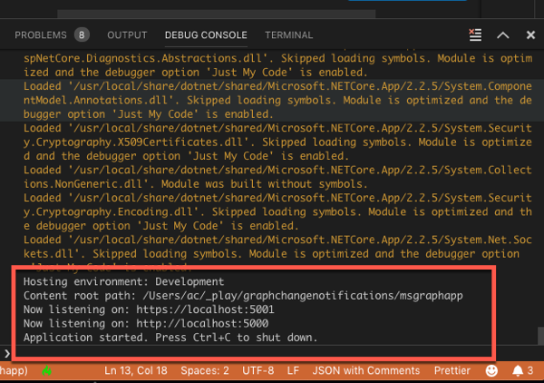

<!-- markdownlint-disable MD002 MD041 -->

Créez une configuration de lancement pour déboguer l’application dans Visual Studio code.

Dans Visual Studio code, sélectionnez **Déboguer > configurations ouvertes**.

  

Lorsque vous êtes invité à sélectionner un environnement, sélectionnez **.net Core**.

  

> [!NOTE]
> Par défaut, la configuration de lancement .NET Core ouvre un navigateur et accède à l’URL par défaut de l’application lors du lancement du débogueur. Pour cette application, nous souhaitons plutôt accéder à l’URL NGrok. Si vous laissez la configuration de lancement telle quelle, chaque fois que vous déboguez l’application, elle affichera une page rompue. Vous pouvez simplement modifier l’URL ou modifier la configuration de lancement pour ne pas lancer le navigateur:

Mettez à jour la configuration de lancement du débogueur Visual Studio:

  1. Dans Visual Studio code, ouvrez le fichier **. vscode/Launch. JSON**.
  1. Recherchez la section suivante dans la configuration par défaut:

      ```json
      "launchBrowser": {
        "enabled": true
      },
      ```

  1. Définissez la `enabled` propriété sur `false`.
  1. Enregistrez vos modifications.

### <a name="test-the-application"></a>Testez l’application:

Dans Visual Studio code, sélectionnez **débogage > démarrer** le débogage pour exécuter l’application. Le code VS génère et étoile l’application.

Une fois que vous avez affiché les éléments suivants dans la fenêtre de la **console** de débogage...



... Ouvrez un navigateur et accédez à **http://localhost:5000/api/notifications** pour vous abonner aux notifications de modification. Si l’opération réussit, vous verrez une sortie qui inclut un ID d’abonnement comme celui ci-dessous:


Votre application est maintenant abonnée pour recevoir des notifications de Microsoft Graph lorsqu’une mise à jour est effectuée sur les utilisateurs du client Office 365.

Déclencher une notification:

1. Ouvrez un navigateur et accédez au [Centre d’administration Microsoft 365 (https://admin.microsoft.com/AdminPortal)](https://admin.microsoft.com/AdminPortal).
1. Si vous êtes invité à vous connecter, connectez-vous à l’aide d’un compte d’administrateur.
1. Sélectionnez **les utilisateurs > utilisateurs actifs**.

    

1. Sélectionnez un utilisateur actif et sélectionnez **modifier** comme **informations de contact**.

    

1. Mettez à jour la valeur de **numéro de téléphone** avec un nouveau numéro, puis sélectionnez **Enregistrer**.

    Dans la **console**de débogage de code Visual Studio, vous verrez une notification a été reçue. Parfois, cette opération peut prendre quelques minutes. Voici un exemple de la sortie:

    ```shell
    Received notification: 'Users/7a7fded6-0269-42c2-a0be-512d58da4463', 7a7fded6-0269-42c2-a0be-512d58da4463
    ```

Cela indique que l’application a réussi à recevoir la notification de Microsoft Graph pour l’utilisateur spécifié dans la sortie. Vous pouvez ensuite utiliser ces informations pour interroger Microsoft Graph pour obtenir des informations complètes sur les utilisateurs si vous souhaitez synchroniser leurs détails dans votre application.