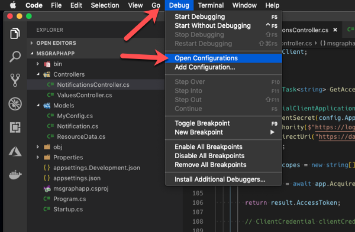
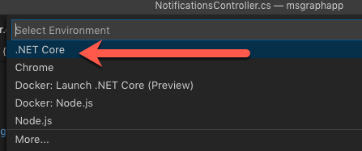

<!-- markdownlint-disable MD002 MD041 -->

<span data-ttu-id="3b5fc-101">Créez une configuration de lancement pour déboguer l’application dans Visual Studio code.</span><span class="sxs-lookup"><span data-stu-id="3b5fc-101">Create a launch configuration to debug the application in Visual Studio Code.</span></span>

<span data-ttu-id="3b5fc-102">Dans Visual Studio code, sélectionnez **Déboguer > configurations ouvertes**.</span><span class="sxs-lookup"><span data-stu-id="3b5fc-102">Within Visual Studio Code, select **Debug > Open Configurations**.</span></span>

  

<span data-ttu-id="3b5fc-104">Lorsque vous êtes invité à sélectionner un environnement, sélectionnez **.net Core**.</span><span class="sxs-lookup"><span data-stu-id="3b5fc-104">When prompted to select an environment, select **.NET Core**.</span></span>

  

> [!NOTE]
> <span data-ttu-id="3b5fc-106">Par défaut, la configuration de lancement .NET Core ouvre un navigateur et accède à l’URL par défaut de l’application lors du lancement du débogueur.</span><span class="sxs-lookup"><span data-stu-id="3b5fc-106">By default, the .NET Core launch configuration will open a browser and navigate to the default URL for the application when launching the debugger.</span></span> <span data-ttu-id="3b5fc-107">Pour cette application, nous souhaitons plutôt accéder à l’URL NGrok.</span><span class="sxs-lookup"><span data-stu-id="3b5fc-107">For this application, we instead want to navigate to the NGrok URL.</span></span> <span data-ttu-id="3b5fc-108">Si vous laissez la configuration de lancement telle quelle, chaque fois que vous déboguez l’application, elle affichera une page rompue.</span><span class="sxs-lookup"><span data-stu-id="3b5fc-108">If you leave the launch configuration as is, each time you debug the application it will display a broken page.</span></span> <span data-ttu-id="3b5fc-109">Vous pouvez simplement modifier l’URL ou modifier la configuration de lancement pour ne pas lancer le navigateur:</span><span class="sxs-lookup"><span data-stu-id="3b5fc-109">You can just change the URL, or change the launch configuration to not launch the browser:</span></span>

<span data-ttu-id="3b5fc-110">Mettez à jour la configuration de lancement du débogueur Visual Studio:</span><span class="sxs-lookup"><span data-stu-id="3b5fc-110">Update the Visual Studio debugger launch configuration:</span></span>

  1. <span data-ttu-id="3b5fc-111">Dans Visual Studio code, ouvrez le fichier **. vscode/Launch. JSON**.</span><span class="sxs-lookup"><span data-stu-id="3b5fc-111">In Visual Studio Code, open the file **.vscode/launch.json**.</span></span>
  1. <span data-ttu-id="3b5fc-112">Recherchez la section suivante dans la configuration par défaut:</span><span class="sxs-lookup"><span data-stu-id="3b5fc-112">Locate the following section in the default configuration:</span></span>

      ```json
      "launchBrowser": {
        "enabled": true
      },
      ```

  1. <span data-ttu-id="3b5fc-113">Définissez la `enabled` propriété sur `false`.</span><span class="sxs-lookup"><span data-stu-id="3b5fc-113">Set the `enabled` property to `false`.</span></span>
  1. <span data-ttu-id="3b5fc-114">Enregistrez vos modifications.</span><span class="sxs-lookup"><span data-stu-id="3b5fc-114">Save your changes.</span></span>

### <a name="test-the-application"></a><span data-ttu-id="3b5fc-115">Testez l’application:</span><span class="sxs-lookup"><span data-stu-id="3b5fc-115">Test the application:</span></span>

<span data-ttu-id="3b5fc-116">Dans Visual Studio code, sélectionnez **débogage > démarrer** le débogage pour exécuter l’application.</span><span class="sxs-lookup"><span data-stu-id="3b5fc-116">In Visual Studio Code, select **Debug > Start debugging** to run the application.</span></span> <span data-ttu-id="3b5fc-117">Le code VS génère et étoile l’application.</span><span class="sxs-lookup"><span data-stu-id="3b5fc-117">VS Code will build and star the application.</span></span>

<span data-ttu-id="3b5fc-118">Une fois que vous avez affiché les éléments suivants dans la fenêtre de la **console** de débogage...</span><span class="sxs-lookup"><span data-stu-id="3b5fc-118">Once you see the following in the **Debug Console** window...</span></span>


<span data-ttu-id="3b5fc-120">... Ouvrez un navigateur et accédez à **http://localhost:5000/api/notifications** pour vous abonner aux notifications de modification.</span><span class="sxs-lookup"><span data-stu-id="3b5fc-120">... open a browser and navigate to **http://localhost:5000/api/notifications** to subscribe to change notifications.</span></span> <span data-ttu-id="3b5fc-121">Si l’opération réussit, vous verrez une sortie qui inclut un ID d’abonnement comme celui ci-dessous:</span><span class="sxs-lookup"><span data-stu-id="3b5fc-121">If successful you will see output that includes a subscription id like the one below:</span></span>


<span data-ttu-id="3b5fc-123">Votre application est maintenant abonnée pour recevoir des notifications de Microsoft Graph lorsqu’une mise à jour est effectuée sur les utilisateurs du client Office 365.</span><span class="sxs-lookup"><span data-stu-id="3b5fc-123">Your application is now subscribed to receive notifications from the Microsoft Graph when an update is made on any users in the Office 365 tenant.</span></span>

<span data-ttu-id="3b5fc-124">Déclencher une notification:</span><span class="sxs-lookup"><span data-stu-id="3b5fc-124">Trigger a notification:</span></span>

1. <span data-ttu-id="3b5fc-125">Ouvrez un navigateur et accédez au [Centre d’administration Microsoft 365 (https://admin.microsoft.com/AdminPortal)](https://admin.microsoft.com/AdminPortal).</span><span class="sxs-lookup"><span data-stu-id="3b5fc-125">Open a browser and navigate to the [Microsoft 365 admin center (https://admin.microsoft.com/AdminPortal)](https://admin.microsoft.com/AdminPortal).</span></span>
1. <span data-ttu-id="3b5fc-126">Si vous êtes invité à vous connecter, connectez-vous à l’aide d’un compte d’administrateur.</span><span class="sxs-lookup"><span data-stu-id="3b5fc-126">If prompted to login, sign-in using an admin account.</span></span>
1. <span data-ttu-id="3b5fc-127">Sélectionnez **les utilisateurs > utilisateurs actifs**.</span><span class="sxs-lookup"><span data-stu-id="3b5fc-127">Select **Users > Active users**.</span></span>

    

1. <span data-ttu-id="3b5fc-129">Sélectionnez un utilisateur actif et sélectionnez **modifier** comme **informations de contact**.</span><span class="sxs-lookup"><span data-stu-id="3b5fc-129">Select an active user and select **Edit** for their **Contact information**.</span></span>

    

1. <span data-ttu-id="3b5fc-131">Mettez à jour la valeur de **numéro de téléphone** avec un nouveau numéro, puis sélectionnez **Enregistrer**.</span><span class="sxs-lookup"><span data-stu-id="3b5fc-131">Update the **Phone number** value with a new number and Select **Save**.</span></span>

    <span data-ttu-id="3b5fc-132">Dans la **console**de débogage de code Visual Studio, vous verrez une notification a été reçue.</span><span class="sxs-lookup"><span data-stu-id="3b5fc-132">In the Visual Studio Code **Debug Console**, you will see a notification has been received.</span></span> <span data-ttu-id="3b5fc-133">Parfois, cette opération peut prendre quelques minutes.</span><span class="sxs-lookup"><span data-stu-id="3b5fc-133">Sometimes this may take a few minutes to arrive.</span></span> <span data-ttu-id="3b5fc-134">Voici un exemple de la sortie:</span><span class="sxs-lookup"><span data-stu-id="3b5fc-134">An example of the output is below:</span></span>

    ```shell
    Received notification: 'Users/7a7fded6-0269-42c2-a0be-512d58da4463', 7a7fded6-0269-42c2-a0be-512d58da4463
    ```

<span data-ttu-id="3b5fc-135">Cela indique que l’application a réussi à recevoir la notification de Microsoft Graph pour l’utilisateur spécifié dans la sortie.</span><span class="sxs-lookup"><span data-stu-id="3b5fc-135">This indicates the application successfully received the notification from the Microsoft Graph for the user specified in the output.</span></span> <span data-ttu-id="3b5fc-136">Vous pouvez ensuite utiliser ces informations pour interroger Microsoft Graph pour obtenir des informations complètes sur les utilisateurs si vous souhaitez synchroniser leurs détails dans votre application.</span><span class="sxs-lookup"><span data-stu-id="3b5fc-136">You can then use this information to query the Microsoft Graph for the users full details if you want to synchronize their details into your application.</span></span>